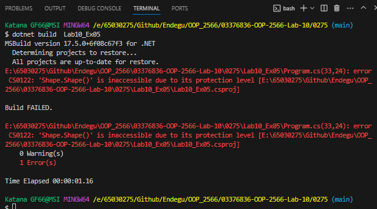
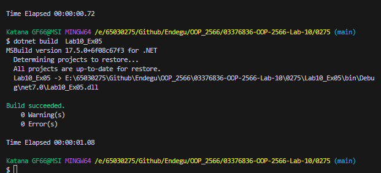

var circle = new Circle();
var rectangle = new Rectangle();
var triangle = new Triangle();

class Shape
{
    private int? NumOfSide;
    private Shape()
    {
    }
    public Shape(int NumOfSide) : this()
    {
       this.NumOfSide = NumOfSide;
        System.Console.WriteLine($"This is some shape with {NumOfSide} sides" );
    }
}
class Circle :Shape
{
    public Circle():base(0)
    {
        System.Console.WriteLine("This is a circle");
    }
}
class Rectangle :Shape
{
    public Rectangle(): base(4)
    {
        System.Console.WriteLine("This is a rectangle");
    }
}
class Triangle :Shape
{
   public Triangle() : base(3) // Triangle has 3 sides
    {
        System.Console.WriteLine("This is a triangle");
    }
}

Circle สืบทอดจาก Shape ซึ่งในคอนสตรัคเตอร์ของ Circle มีการเรียกใช้ base(0) เพื่อสร้าง Shape และแสดงข้อความ