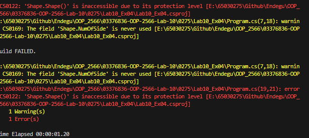
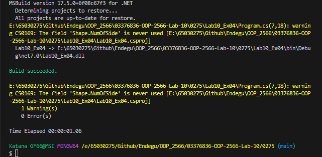

var circle = new Circle();
var rectangle = new Rectangle();
var triangle = new Triangle();

class Shape
{
    private int? NumOfSide;
    public Shape()
    {
        System.Console.WriteLine("This is some shape with unknown side");
    }
    public Shape(int NumOfSide)
    {
        System.Console.WriteLine($"This is some shape with {NumOfSide} sides" );
    }
}
class Circle : Shape
{
    public Circle() : base(0)
    {
        System.Console.WriteLine("This is a circle");
    }
}
class Rectangle : Shape
{
    public Rectangle() : base(4)
    {
        System.Console.WriteLine("This is a rectangle");
    }
}
class Triangle : Shape
{
    public Triangle() : base(3)
    {
        System.Console.WriteLine("This is a triangle");
    }
}

สร้างคลาส Shape เป็นคลาสหลัก และคลาส Circle, Rectangle, Triangle เป็นคลาสที่สืบทอดจาก Shape โดยแต่ละคลาสมีการสร้าง constructor โดยมี parameter ต่างกัน
